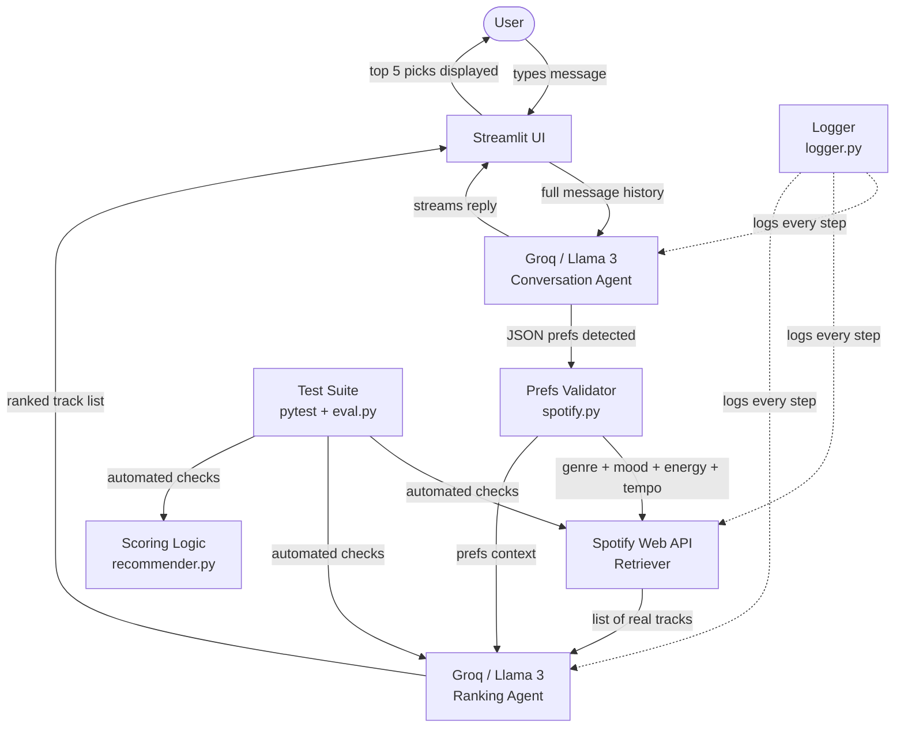

# Music Recommender

A conversational AI music recommendation app. You chat with an AI that learns your taste, retrieves real tracks from Spotify, and ranks them for you — all running in your browser on localhost.

---

## Original Project (Modules 1–3)

**VibeFinder 1.0** was a rule-based music recommender simulation. It scored songs from a static 20-song CSV file against a hardcoded user preference profile using a weighted feature-matching algorithm across genre, mood, energy, tempo, danceability, and acousticness. Songs scoring above 0.85 were recommended in a CLI table. It demonstrated how recommender systems turn structured data into ranked suggestions, but was limited to a tiny catalog with no real user interaction.

---

## What This Project Does

The upgraded system replaces the static catalog and scripted profiles with a live conversational loop. A Groq-powered AI chats with you to discover what you're in the mood for, retrieves real tracks from Spotify's catalog, then uses the AI again to rank those tracks by how well they match your described taste. The result is a fully interactive, browser-based music recommender backed by a real music database and an AI that understands natural language.

---

## System Diagram



**Data flow summary:**
- Input: natural language from the user
- Process: Groq extracts structured preferences → Spotify retrieves matching tracks → Groq ranks them
- Output: top 5 ranked songs displayed in the chat UI
- Guardrails: prefs are validated and clamped before any API call; fallback search runs if the genre returns nothing
- Testing: automated tests verify the Spotify connection, Groq ranking, and core scoring logic; the eval harness tests full end-to-end scenarios

---

## Architecture Overview

The system has four main components:

| Component | File | Role |
|---|---|---|
| Conversation Agent | `src/chat.py` | Gathers user preferences through natural conversation using Groq (Llama 3.3) |
| Retriever | `src/spotify.py` | Searches Spotify for real tracks matching the user's genre |
| Ranking Agent | `src/spotify.py` | Asks Groq to rank retrieved tracks against the user's full preference profile |
| UI | `app.py` | Streamlit web interface with streaming chat and results display |

This is a **Retrieval-Augmented Generation (RAG)** architecture: the AI does not hallucinate song titles. It first retrieves real tracks from Spotify, then uses those actual results as context when generating the ranked recommendation list.

---

## Setup Instructions

### 1. Clone the repo

```bash
git clone <your-repo-url>
cd applied-ai-system-project
```

### 2. Create a virtual environment

```bash
python -m venv .venv
source .venv/bin/activate      # Mac / Linux
.venv\Scripts\activate         # Windows
```

### 3. Install dependencies

```bash
pip install -r requirements.txt
```

### 4. Configure API keys

```bash
cp .env.example .env
```

Open `.env` and fill in your credentials (see below for how to get them).

---

## Getting a Groq API Key

1. Go to [console.groq.com](https://console.groq.com) and sign up (free, no credit card)
2. Navigate to **API Keys** in the left sidebar
3. Click **Create API Key**, copy it, and add it to `.env`:

```
GROQ_API_KEY=your_key_here
```

---

## Getting Spotify API Credentials

1. Go to [developer.spotify.com/dashboard](https://developer.spotify.com/dashboard) and log in
2. Click **Create App**, fill in any name and description
3. Set Redirect URI to `http://localhost:8888/callback` and click **Save**
4. Open your app's **Settings** to find your Client ID and Client Secret
5. Add both to `.env`:

```
SPOTIFY_CLIENT_ID=your_client_id_here
SPOTIFY_CLIENT_SECRET=your_client_secret_here
```

> New Spotify apps are in Development mode, which limits search results to 10 tracks per request.

---

## Running the App

```bash
python -m streamlit run app.py
```

Opens at `http://localhost:8501`.

---

## Sample Interactions

**Example 1 — Lo-fi study session**

Preferences extracted by AI: `genre=lo-fi, mood=chill, energy=0.3, tempo=80`

```
1. Soft Piano for Baby Sleep - Derrol
2. concatenate (Interlude) - dreokt
3. Toasted Loaf - Slowed + Reverb - Minijau
4. Intro - Natsu Fuji
5. Feeling Myself - Rafael Manso
```

**Example 2 — High energy hip hop workout**

Preferences extracted by AI: `genre=hip-hop, mood=intense, energy=0.9, tempo=150`

```
1. Woah - Munch Lauren
2. Big Watch - BL@CKBOX
3. Ain't Bout That Life - Baby Brown
4. Pack Your Bags - Red Shaydez
5. Barcode - Icaki
```

**Example 3 — Moody jazz afternoon**

Preferences extracted by AI: `genre=jazz, mood=moody, energy=0.35, tempo=85`

```
1. Madwoman - Laufey
2. Falling Behind - Laufey
3. From The Start - Laufey
4. Too Little, Too Late - Laufey
5. Valentine - Laufey
```

---

## Design Decisions

**Groq over OpenAI or Anthropic**
Groq provides free API access to Llama 3.3-70b with no credit card required and very fast inference. For a student project with frequent iteration, this removes the friction of credits and billing.

**Streamlit over Flask or FastAPI**
Streamlit was already in the project's requirements and provides built-in chat components (`st.chat_message`, `st.chat_input`, `st.write_stream`) that handle streaming responses natively. Building the same UI in Flask would have required significant extra frontend code.

**Groq for ranking instead of numeric scoring**
Spotify deprecated their audio features endpoint (`/audio-features`) for Development mode apps in 2024, returning a 403 Forbidden error. This made the original rule-based scoring system impossible to use with real Spotify data. Switching to Groq-based natural language ranking is actually more flexible — it understands nuanced descriptions like "moody but not aggressive" without needing numeric features.

**RAG over pure generation**
Letting the AI generate song recommendations directly risks hallucination — made-up artist names, wrong song titles, or songs that don't exist on Spotify. By first retrieving real tracks from Spotify and having Groq rank only those results, every recommendation is a real, playable song.

**Trade-offs made:**
- Spotify Development mode caps results at 10 tracks, limiting diversity
- Groq's ranking is subjective — the same prompt can return slightly different orderings on each run
- The system has no memory between sessions; preferences are not saved

---

## Testing Summary

| Test | What It Checks | Result |
|---|---|---|
| `test_recommender.py` | In-memory song scoring and explanation logic | Pass |
| `test_spotify.py` | Spotify search returns Frank Sinatra's "My Way" | Pass |
| `test_groq.py` | Groq selects a moody slow lo-fi track from real Spotify results | Pass |
| `eval.py` | Full end-to-end pipeline across 3 genre scenarios | Pass |

**4/4 automated tests pass. Eval harness: 3/3 scenarios pass.**

**Guardrail in action — fallback genre search**

When a genre label isn't recognized by Spotify's genre index (e.g. `dark academia`), the fallback guardrail automatically retries with a plain keyword search:

```
INFO  [spotify] Searching Spotify: genre='dark academia', limit=10 (attempt 1)
WARN  [spotify] genre:'dark academia' returned 0 tracks, trying plain keyword search
INFO  [spotify] Spotify returned 10 tracks for 'dark academia'
```

Results recovered:
```
- Dark Academia - Heavenly Realms
- Dark Academia - Gabriel Saban
- Dark Academia Instrumental - Study Music Project
```

Without this guardrail the app would silently return no recommendations. With it, the user still gets results.

Things that did not work as expected during development:
- Spotify's `audio_features` endpoint returned 403 for Development mode accounts — the entire numeric scoring layer had to be replaced
- Spotify's `genre:` search caps at 10 results (not 50 as documented), causing unexpected 400 errors
- `load_dotenv()` does not override existing Windows environment variables — required switching to `load_dotenv(override=True)` throughout

---

## Reflection and Ethics

**Limitations and biases**
The system is limited to Spotify's catalog, which skews heavily toward popular Western artists. Niche genres, regional music, and independent artists are underrepresented. The 10-result cap in Development mode further narrows diversity. Groq's ranking reflects patterns in its training data, which may favor mainstream or well-known tracks.

**Potential misuse**
The app makes repeated calls to both Groq and Spotify APIs. A bad actor could use it to flood either API with automated requests. Spotify enforces rate limits at the API level. On the Groq side, the free tier rate limits (requests per minute) act as a natural throttle. Adding request rate limiting to the app itself would be a future improvement.

**What surprised me during testing**
The most surprising discovery was that Spotify had silently removed audio feature access for Development mode apps — an API that was documented as available returned a 403 with no clear error message explaining why. It forced a complete rethink of the ranking system. The replacement (asking Groq to rank by description) turned out to work better than the original numeric scoring because it handles nuance like mood and context that numbers cannot capture.

**Collaboration with AI during this project**
Claude Code was used throughout development to build and debug the system.

One helpful suggestion: when the Groq chat was freezing the UI, the suggestion to use `st.write_stream` with a streaming generator from Groq was exactly right — it made the UI feel live and responsive with minimal code changes.

One flawed suggestion: the initial `search_songs` implementation passed `limit=50` to Spotify's search API, which the AI confidently stated was within the allowed range. In practice, Spotify's Development mode only allows up to 10, causing 400 errors on every search. The limit had to be discovered by trial and error.

---

## Running Tests

```bash
python -m pytest -v
```

Run the evaluation harness:

```bash
python tests/eval.py
```

---

## Project Structure

```
app.py                  # Streamlit web app (entry point)
src/
  chat.py               # Groq conversation logic and prefs extraction
  spotify.py            # Spotify search, prefs validation, Groq ranking
  recommender.py        # Original Song/UserProfile models and scoring logic
  logger.py             # Centralized logging to logs/YYYY-MM-DD.log
  main.py               # Terminal entry point (alternative to app.py)
tests/
  test_recommender.py   # Unit tests for scoring logic
  test_spotify.py       # Integration test — Spotify search
  test_groq.py          # Integration test — Groq ranking
  eval.py               # Evaluation harness — end-to-end scenario runner
logs/                   # Auto-generated, gitignored
.env.example            # Template for required environment variables
```
